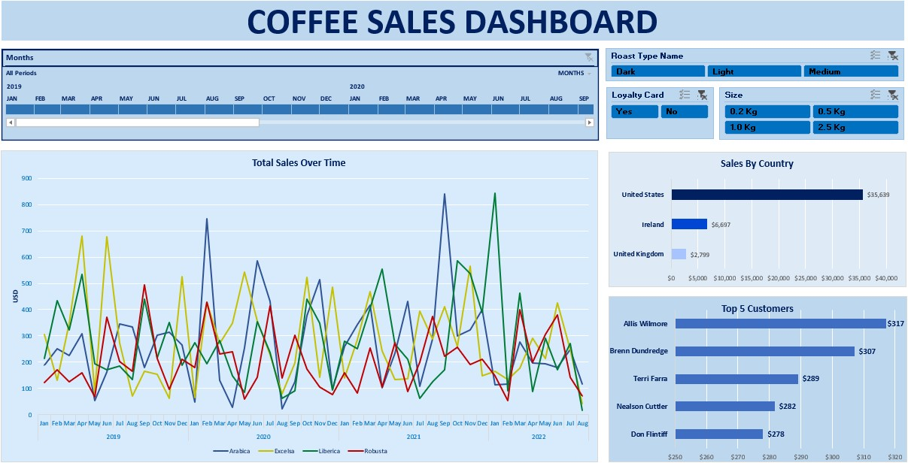

# Introduction  
This project analyzes sales data to identify trends, customer behavior, and regional sales performance. By cleaning, structuring, and visualizing the data, we gain insights into overall sales growth, top customers, and key markets.  
- Check the file here: [Excel](Project.xlsx)

# Background  
The data used in this project is sourced from [coffeOrders data set](coffeeOrdersData.xlsx), which include information about **order dates, product names, quantities, unit prices, customer names, and countries**. By analyzing this data, we can uncover patterns in sales growth, customer purchasing behavior, and regional market performance.  

### The questions I wanted to answer through my analysis were:  
1. 📈 How have sales changed over time?  
2. 🏆 Who are the top customers?  
3. 🌍 Which countries contribute most to sales?   

# 🛠 Tools Used  
- **Excel**  
  - XLOOKUP, INDEX, IF statements  
  - Pivot Tables, Graphs, Slicers  
  - Data formatting and validation  

# 🔍 Analysis  
## Data Cleaning & Structuring  
- 🧹 Filled missing values and reformatted data.  
- 🔤 Standardized abbreviations and date formats.  
- 📑 Converted dataset into a structured table.  

## Visualization & Insights  
### **Sales Over Time**

- Sales exhibit high volatility across all product types.
- There are recurring peaks and dips, suggesting seasonal trends.
- Arabica (blue) and Liberica (green) have the highest peaks, indicating occasional surges in demand.
### **Top 5 Customers**

- Allis Wilmore is the top customer, contributing $317.
- Brenn Dundredge follows closely at $307.
- The difference between the top and lowest (Don Flintiff at $278) is relatively small, indicating a balanced contribution among top customers.
### **Sales by Country**

- The United States dominates sales at $35,639, vastly outperforming other countries.
- Ireland contributes significantly less at $6,697.
- The United Kingdom has the lowest sales at $2,799.
- The U.S. market is the primary revenue driver.
## Dashboard

- **Here’s a breakdown of the Coffee Sales Dashboard:**
- Time Filter: Allows selection of months from 2019 to 2020.
- Total Sales Over Time: Line chart showing sales trends of different coffee types (Arabica, Excelsa, Liberica, Robusta).
- Sales By Country: Bar chart showing sales distribution:
- Top 5 Customers: Ranked list with sales amounts:
- Roast Type Selection: Options for Dark, Light, and Medium.
- Loyalty Card Filter: Yes/No selection.
- Size Selection: Options from 0.2 Kg to 2.5 Kg.
# 📌 Conclusion  
The analysis provided valuable insights into sales performance, customer trends, and regional distribution. Using dynamic tables and interactive visualizations improved data exploration and decision-making.  
  
